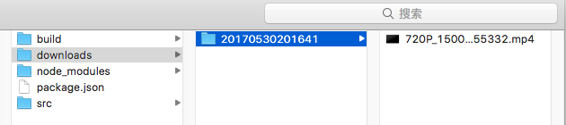

# pornhub-downloader
Download videos one by one from pornhub automatically.  
  

## Usage
1. clone this project.  
2. go to the directory on the terminal.  
3. run `nmp install`  
4. run `npm start`  
5. waiting and then enjoy!(videos will be downloaded on the `downloads/` folder)  

note: This is a node.js project, so you have to install [node.js](https://nodejs.org/en/) on your operating system before you run above commands.

## Config
You can edit `src/config.js` to change settings.  
`START_PAGE`: the star page number, defaults to 1.  
`PAGES`: how many pages do you want to download(20 videos/page)? defaults to 100.  
`SEARCH`: keyword of searching. **TODO**  
`DOWNLOAD_DIR`: the folder to save videos. defaults to 'downloads/'.

## Download speed
1. the speed depends on your network.
2. chinese people maybe need to setup a VPN network.

## TODO
1. search by keyword.  
2. muti-tasks, download serveral videos async.