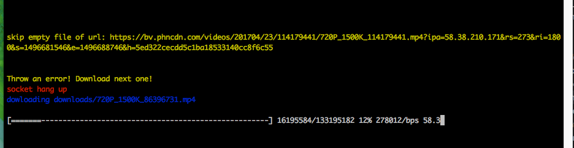
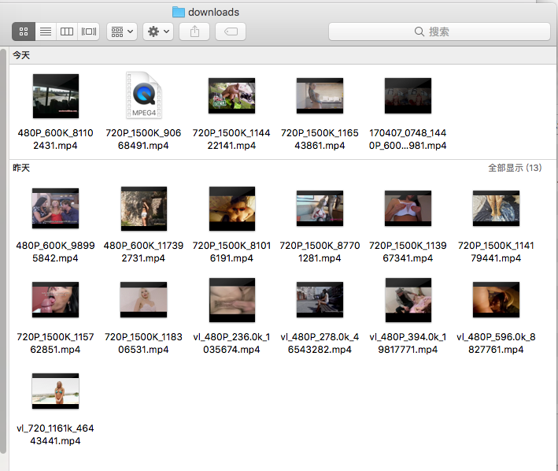

# pornhub-downloader
[以中文查看](./README_ZH.md)  
Download videos from [pornhub](https://www.pornhub.com) one by one automatically.  
  
**PS**: As you see the picture above. It will skip empty file when downloading. And skip error, and then download next one. Also, you can setup timeout in a small value. Everything is for downloading more valid videos.  

   

**PS**: You can watch the videos by simple "double click"! lol~~

## Usage
1. clone this project.  
2. go to the directory on the terminal.  
3. run `nmp install`  
4. run `npm start`  
5. waiting and then enjoy!(videos will be downloaded on the `downloads/` folder)  

Note: This is a node.js project, so you have to install [node.js](https://nodejs.org/en/) on your operating system before you run above commands.

## Config
You can edit `src/config.js` to change settings.  
`START_PAGE`: the star page number, defaults to 1.  
`PAGES`: how many pages do you want to download(20 videos/page)? defaults to 100.  
`SEARCH`: keyword of searching.   
`DOWNLOAD_DIR`: the folder to save videos. defaults to 'downloads/'.  
`TIMEOUT`: timeout value, defaults to 3 minutes.

## Download speed
1. the speed depends on your network.
2. chinese people maybe need to setup a VPN network.

## TODO
1. <del>search by keyword.</del>  
2. muti-tasks, download serveral videos async.

## Why
Someone may be interested in why I do this. My answer is: I love coding, I believe I can fetch download information from pornhub, and then download videos by the information. So I do it. It's just for fun about coding.

## LICENCE
MIT