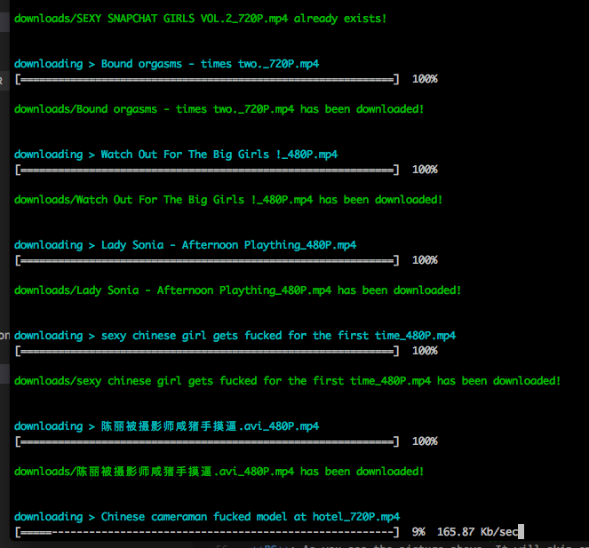
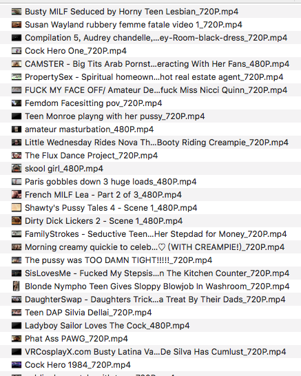

# pornhub-downloader

Download highest quality videos from [pornhub](https://pornhub.com).

**Version 2.0 is coming now!**

## Features

* Support proxy setting.

* Always choose highest quality video to download(720P usually).

* Support keyword searching.

* Show progress bar and download speed.

* Skip repeat file.

* Download one by one until error occurs or fetch nothing.

## Requirement

* Node.js 7.6.0+.

* Your network can access [pornhub.com](https://pornhub.com).

## Usage

* clone this repo.

* `npm install`

* `npm start`

## Configuration

You can config some params on `src/config.json`.

`proxyUrl`: set up the proxy with port. For example: `http://127.0.0.1:1087`.
If you don't need to set up proxy,just keep it empty string.

`timeout`: set up request timeout.

`search`: the keyword for searching.

`barWidth`: the progress bar width, should be between 20 to 120, set up 60 by default.

`barFullChar`: the 'finished char' for the progress bar.

`barEmptyChar`: the 'unfinished char' for the progress bar.

`downloadDir`: the directory you want to save videos.

## Screenshots

## Download speed

The speed depends on your local network or proxy.

## LICENCE

MIT